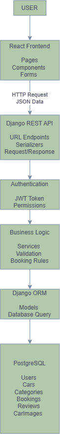

# API Documentation

## Overview

This document describes the REST API of the Car Rental Portal.

The API provides communication between:

- Frontend application
- Backend application
- Database layer

The API is responsible for:

- receiving client requests
- validating data
- executing business logic
- returning responses

---

# API Architecture




---

# Base URL

Development:

```

[http://localhost:8000/api/](http://localhost:8000/api/)

```

Production:

```

[https://api.car-rental.com/api/](https://api.car-rental.com/api/)

```

---

# API Style

The project uses REST API principles.

Main HTTP methods:

| Method | Purpose              |
|--------|----------------------|
| GET    | Retrieve data        |
| POST   | Create new data      |
| PUT    | Update existing data |
| PATCH  | Partial update       |
| DELETE | Delete data          |

Example:

```

GET /api/cars/

```

Returns available cars.


---

# Authentication

The API uses token-based authentication.

Authentication flow:

1. User sends login credentials.
2. Backend validates credentials.
3. Backend generates authentication token.
4. Client sends token with future requests.

Example:

Request:

```

POST /api/auth/login/

````

Body:

```json
{
  "email": "user@example.com",
  "password": "password123"
}
````

Response:

```json
{
  "access_token": "token_value",
  "user_id": "uuid"
}
```

---

# Authorization

The system has different user roles:

## Customer

Can:

* view cars
* create bookings
* view own bookings
* create reviews

## Admin

Can:

* create cars
* update cars
* delete cars
* manage users
* manage bookings

---

# Response Format

All API responses use JSON.

Successful response example:

```json
{
  "id": "uuid",
  "message": "Success"
}
```

Error response example:

```json
{
  "error": "Invalid data",
  "details": {
    "field": "Required field"
  }
}
```

---

# HTTP Status Codes

Common responses:

| Code | Meaning                 |
|------|-------------------------|
| 200  | Successful request      |
| 201  | Resource created        |
| 204  | Successfully deleted    |
| 400  | Validation error        |
| 401  | Authentication required |
| 403  | Permission denied       |
| 404  | Resource not found      |
| 500  | Server error            |

---

# API Endpoints

# Authentication

## Register User

Creates a new user.

### Request

```
POST /api/auth/register/
```

Body:

```json
{
  "email": "user@example.com",
  "password": "password123"
}
```

Response:

```json
{
  "message": "User created successfully"
}
```

---

## Login User

```
POST /api/auth/login/
```

Body:

```json
{
  "email": "user@example.com",
  "password": "password123"
}
```

Response:

```json
{
  "token": "jwt_token"
}
```

---

# Cars

## Get All Cars

```
GET /api/cars/
```

Response:

```json
[
  {
    "id": "uuid",
    "brand": "BMW",
    "model": "X5",
    "price_per_day": 100
  }
]
```

---

## Get Car Details

```
GET /api/cars/{id}/
```

Example:

```
GET /api/cars/550e8400/
```

Response:

```json
{
  "id": "uuid",
  "brand": "BMW",
  "model": "X5",
  "category": "SUV"
}
```

---

## Create Car (Admin)

```
POST /api/cars/
```

Body:

```json
{
  "brand": "BMW",
  "model": "X5",
  "year": 2024,
  "price_per_day": 100
}
```

---

# Bookings

## Create Booking

Creates a car reservation.

```
POST /api/bookings/
```

Body:

```json
{
  "car_id": "uuid",
  "start_date": "2026-08-01",
  "end_date": "2026-08-05"
}
```

Backend checks:

* car exists
* car availability
* rental dates

Response:

```json
{
  "booking_id": "uuid",
  "status": "confirmed"
}
```

---

## Get User Bookings

```
GET /api/bookings/
```

Returns current user's bookings.

---

# Reviews

## Create Review

```
POST /api/reviews/
```

Body:

```json
{
  "booking_id": "uuid",
  "rating": 5,
  "comment": "Great car"
}
```

Rules:

* user can review only completed bookings
* one booking can have one review

---

# Error Handling

The API returns clear error messages.

Example:

Invalid booking:

```json
{
  "error": "Car is not available for selected dates"
}
```

---

# API Security

The API uses:

* authentication
* authorization
* input validation
* password hashing
* HTTPS communication

---

# API Versioning

Future versions can be supported:

```
/api/v1/cars/

/api/v2/cars/
```

---

# API Documentation Tools

The project will use:

* Swagger UI
* OpenAPI schema

Available at:

```
/api/docs/
```

---

# API Flow Example

Booking process:

```
User

 |

Frontend

 |

POST /api/bookings/

 |

Backend API

 |

Validation

 |

Database

 |

Response

 |

Frontend
```

---

# Future Extensions

Possible future API modules:

* payments
* notifications
* favorites
* search filters
* recommendations


