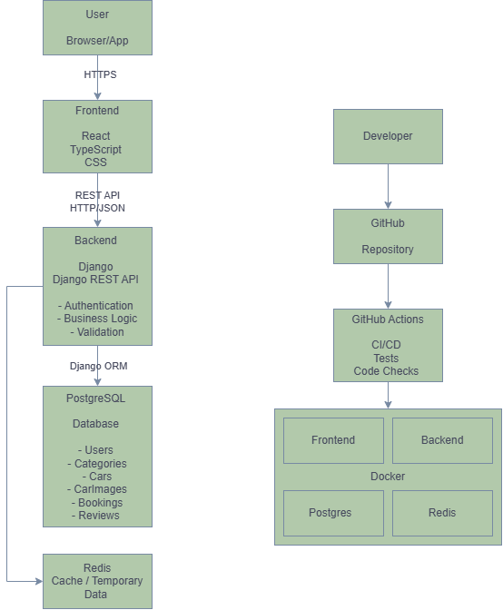

# System Architecture

## Overview

This document describes the overall architecture of the Car Rental Portal.

The system is divided into several independent layers:

- Frontend application
- Backend API
- Database layer
- Infrastructure layer

The main goal of this architecture is to provide:

- scalability
- maintainability
- separation of responsibilities
- secure communication between components

---

# System Architecture Diagram



---

# High-Level Architecture

The application follows a client-server architecture.

The main communication flow:

```

User
|
|
Frontend (React)
|
|
HTTP/REST API
|
|
Backend (Django REST Framework)
|
|
PostgreSQL Database

```

---

# Frontend Layer

## Technology

- React
- TypeScript
- CSS
- REST API Client

---

## Responsibility

The frontend is responsible for:

- displaying user interface
- handling user interactions
- sending requests to backend
- displaying responses from API
- managing client-side state

---

## Frontend Structure

```

frontend/

src/
├── components/
├── pages/
├── services/
├── hooks/
├── types/
└── utils/

```

---

## Frontend does NOT handle:

- database operations
- authentication logic
- business rules
- booking validation

All important logic belongs to backend.

---

# Backend Layer

## Technology

- Python
- Django
- Django REST Framework

---

## Responsibility

Backend provides:

- business logic
- API endpoints
- authentication
- authorization
- database communication
- validation
- application rules

---

## Backend Structure

```

backend/

app/

    ├── users/
    ├── cars/
    ├── bookings/
    ├── reviews/
    ├── common/

├── config/
├── media/
├── static/
└── tests/

```

---

# Backend Applications

## Users

Responsible for:

- user registration
- authentication
- user roles
- permissions

---

## Cars

Responsible for:

- car management
- categories
- car images
- car information

---

## Bookings

Responsible for:

- creating reservations
- checking availability
- rental periods
- booking status

---

## Reviews

Responsible for:

- customer reviews
- ratings
- review validation

---

## Common

Contains shared functionality:

- utilities
- base classes
- shared helpers

---

# API Layer

The backend provides REST API endpoints.

Example:

```

Frontend
|
|
GET /api/cars/
|
|
Backend
|
|
Database

```

---

# Database Layer

## Technology

PostgreSQL

---

## Responsibility

Database stores:

- users
- cars
- categories
- bookings
- reviews
- images

---

The backend communicates with the database through Django ORM.

Example:

```

Django Models


    |
    |

Django ORM


    |
    |

PostgreSQL

```

---

# Authentication Flow

Authentication process:

```

User

|
|
Login request

|
|
Backend

|
|
Validate credentials

|
|
Generate token

|
|
Return response

|
|
Frontend stores token

```

---

# Booking Flow

Main business flow:

```

User

|
|
Select car

|
|
Create booking request

|
|
Backend checks availability

|
|
Create booking

|
|
Save data to database

|
|
Return result

```

---

# Infrastructure Layer

## Docker

Docker is used for:

- application containerization
- local development environment
- deployment consistency

Main containers:

```

Frontend container

Backend container

PostgreSQL container

Redis container

```

---

# CI/CD

## GitHub Actions

Used for:

- running tests
- checking code quality
- automatic validation

Pipeline:

```

Push code

|

GitHub Actions

|

Run tests

|

Check formatting

|

Build application

```

---

# Project Communication Flow

Complete system flow:

```
          User

           |

           |

    React Frontend

           |

      HTTP Requests

           |

           |

    Django Backend

           |

    Django ORM

           |

           |

    PostgreSQL

```

# Design Principles

The project follows these principles:

## Separation of Responsibilities

Each layer has its own responsibility.

Frontend:

- UI

Backend:

- business logic

Database:

- data storage

## Scalability

The system can be extended with:

- payments
- notifications
- caching
- microservices

## Maintainability

The project structure allows:

- easier debugging
- independent development
- easier testing