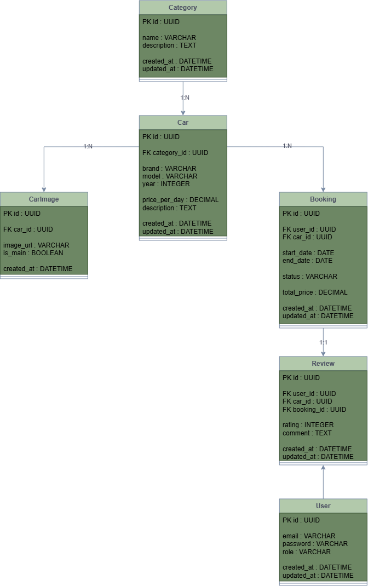

# Database Design

## Overview

This document describes the database structure of the Car Rental Portal.

The database is designed to store and manage information about:

- users
- car categories
- cars
- car images
- bookings
- reviews

The database is based on a relational model and uses PostgreSQL as the primary database.

---

# Database Diagram



---

# Entities

## User

### Description

Stores customer and administrator accounts.

### Fields

| Field      | Type     | Description                |
|------------|----------|----------------------------|
| id         | UUID     | Primary key                |
| email      | varchar  | User email address         |
| password   | varchar  | Hashed user password       |
| role       | varchar  | User role (customer/admin) |
| created_at | datetime | Account creation date      |
| updated_at | datetime | Last account update date   |

---

## Category

### Description

Stores car categories used for filtering and organizing vehicles.

### Fields

| Field       | Type     | Description               |
|-------------|----------|---------------------------|
| id          | UUID     | Primary key               |
| name        | varchar  | Category name             |
| description | text     | Category description      |
| created_at  | datetime | Category creation date    |
| updated_at  | datetime | Last category update date |

---

## Car

### Description

Stores available rental vehicles.

### Fields

| Field         | Type     | Description               |
|---------------|----------|---------------------------|
| id            | UUID     | Primary key               |
| category_id   | UUID     | Reference to car category |
| brand         | varchar  | Car manufacturer          |
| model         | varchar  | Car model                 |
| year          | integer  | Production year           |
| price_per_day | decimal  | Daily rental price        |
| description   | text     | Car description           |
| created_at    | datetime | Car creation date         |
| updated_at    | datetime | Last car update date      |

---

## CarImage

### Description

Stores images related to rental cars.

A car can have multiple images.

### Fields

| Field      | Type     | Description               |
|------------|----------|---------------------------|
| id         | UUID     | Primary key               |
| car_id     | UUID     | Reference to car          |
| image_url  | varchar  | Image storage path or URL |
| is_main    | boolean  | Indicates main car image  |
| created_at | datetime | Image upload date         |

---

## Booking

### Description

Stores customer car rental reservations.

Booking represents the process of reserving a vehicle for a specific period.

### Fields

| Field       | Type     | Description               |
|-------------|----------|---------------------------|
| id          | UUID     | Primary key               |
| user_id     | UUID     | Reference to customer     |
| car_id      | UUID     | Reference to reserved car |
| start_date  | date     | Rental start date         |
| end_date    | date     | Rental end date           |
| status      | varchar  | Booking status            |
| total_price | decimal  | Final rental price        |
| created_at  | datetime | Booking creation date     |
| updated_at  | datetime | Last booking update date  |

### Booking Status

Possible values:

- pending
- confirmed
- completed
- cancelled

---

## Review

### Description

Stores customer reviews for completed bookings.

A user can leave one review per completed booking.

### Fields

| Field      | Type     | Description             |
|------------|----------|-------------------------|
| id         | UUID     | Primary key             |
| user_id    | UUID     | Review author           |
| car_id     | UUID     | Reviewed car            |
| booking_id | UUID     | Related booking         |
| rating     | integer  | Rating from 1 to 5      |
| comment    | text     | Review text             |
| created_at | datetime | Review creation date    |
| updated_at | datetime | Last review update date |

---

# Relationships

## User - Booking

```

User 1:N Booking

```

One user can create multiple bookings.

Example:

```

User
|
├── Booking #1
├── Booking #2
└── Booking #3

```

---

## Category - Car

```

Category 1:N Car

```

One category can contain multiple cars.

Example:

```

SUV Category

├── BMW X5
├── Audi Q7
└── Toyota Land Cruiser

```

---

## Car - CarImage

```

Car 1:N CarImage

```

One car can have multiple images.

Example:

```

BMW X5

├── front.jpg
├── interior.jpg
└── back.jpg

```

---

## Car - Booking

```

Car 1:N Booking

```

One car can have multiple bookings during different periods.

---

## User - Review

```

User 1:N Review

```

One user can write multiple reviews for different completed bookings.

---

## Car - Review

```

Car 1:N Review

```

One car can have multiple reviews from different users.

---

## Booking - Review

```

Booking 1:1 Review

```

One completed booking can have only one review.

---

# Database Constraints

The database should enforce the following rules:

- User email must be unique.
- Booking dates cannot overlap for the same car.
- Review can be created only for completed bookings.
- One booking can have only one review.
- Rating value must be between 1 and 5.
- Foreign keys must maintain data integrity.

---

# Future Improvements

Possible future extensions:

- payments table
- notifications table
- rental history
- discounts and promotions
- insurance options


